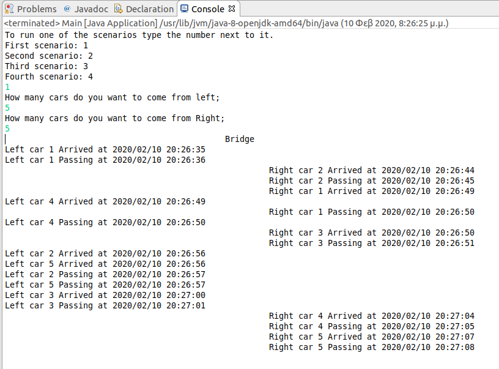
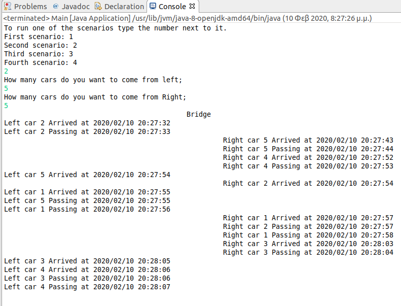

# Parallel computing with Java

This is an example of parallel computing with Java. The example has to do with a bridge that cars from both of its sides are crossing it. The cars are the threads of the system and the bridge is the common resource of the system that the threads try to access.  

The system implements four scenarios. 
<ol>
  <li>The cars are crossing the bridge simultaneously, so the systmen doesn't lock the common resource, which is the bridge.</li>
  <li>The cars can not cross the bridge simultaneously, only one at time, so the system locks the common resource</li>
  <li>It is the same with the scenario 2, with the difference that the cars cross the bridge in turns. For example, if a car from left crossed the bridge then the next car that cross the bridge will be from the right side. Also, if it is the turn of a car from the right side to cross the bridge and the is no car from the right to cross the bridge, if there are cars to the left side, they will waiting until a car from the right side comes and cross the bride. 
</li>
  <li>It is the same with the scenario 3, with the difference that if in one side are waiting more than five cars and it is the turn of a car from the opposite side to cross the bridge, then cars from the other side will not wait and start to cross the bridge, until the number of the cars that are waiting in that side are not more than five</li>
</ol>  

# Examples

Next, will be presented the results of the execution of the software for the first two scenarios. Generally, in all the scenarios a car needs one second to cross the bridge.  

# First scenario 
Figure 1.1 shows the results of the execution of the software for the first scenario.  

 <b>Figure 1.1 First scenario</b> 

The car from left with id 4 and the car from rigth with id 1 are both arriving at the bridge at the same time 
20:26:49 and they are passing simultaneously the bridge and arriving each to the other side at 20:26:50. 

# Second scenario 
Figure 1.2 shows the results of the execution of the software for the second scenario.   
 <b>Figure 1.2 Second scenario</b> 

The car from left with id 5 and the car from rigth with id 2 are both arriving at the bridge at the same time 
20:27:54 but they don't cross the bridge simultaneously. The car from left with id 5 arrived accross the bridge at 20:27:55 and the car from ride with id 2 arrived accross the bridge at 20:27:57, which means she wait for two second at the bridge and started to cross the bridge at 20:27:56 .

